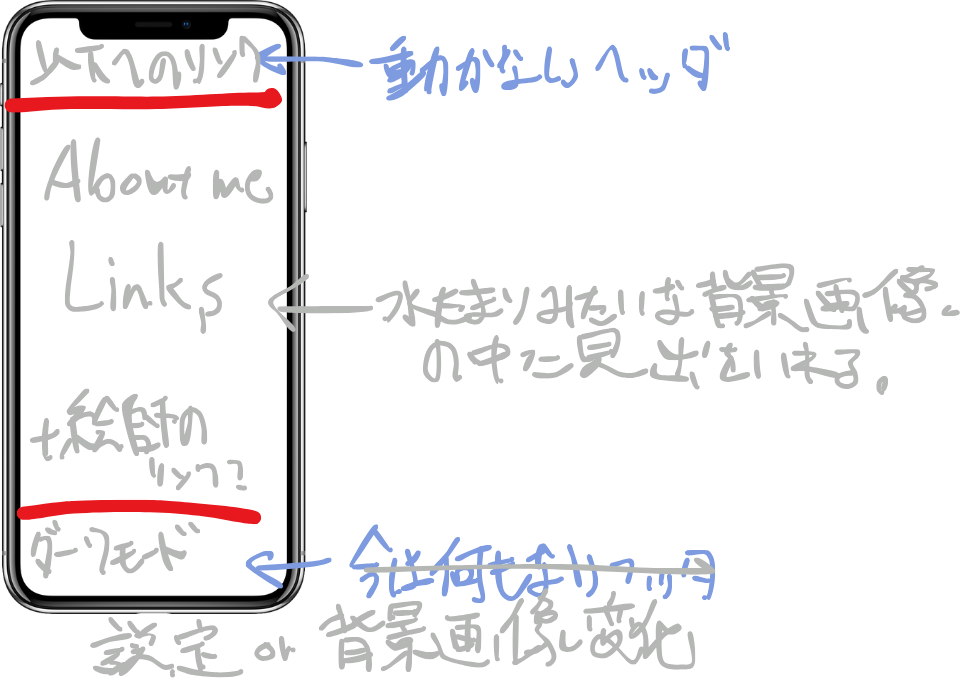

# 順番決め

**1.** 成果物の構想をつくる。

**2.** progate の index.html と responsive.css, style.css を参考にスマホとパソコンから見ても違和感のないように html と css をまずは書く。

**3.** javascript の参考 UI をもとに動きを加えていく。

**4.** css を tailwind を使って書き換えていく。
